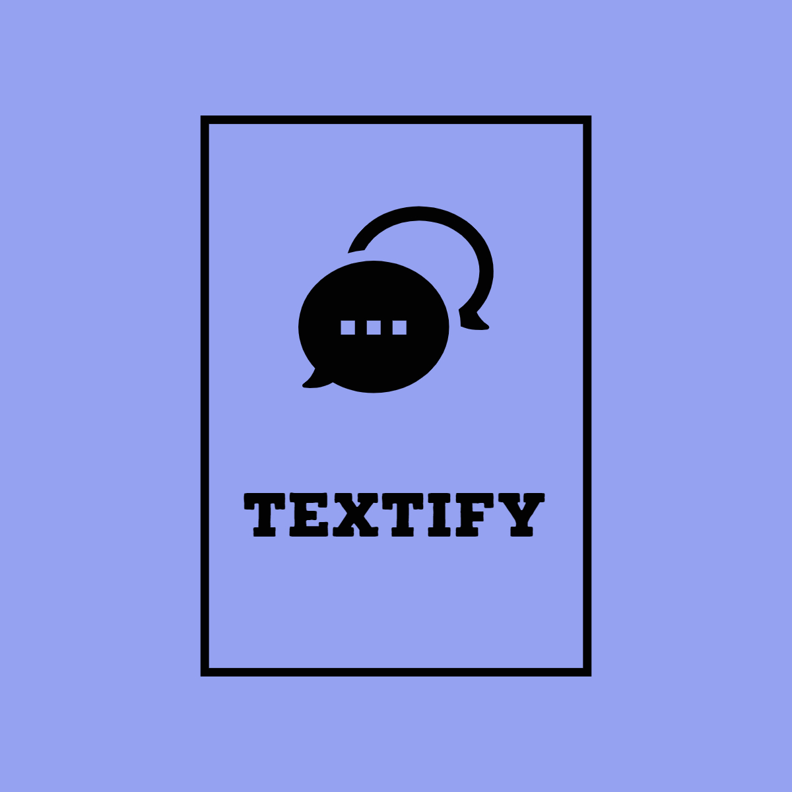

# Textify -  audio messaging, on another level!


<p align="center">

</p>
	

Textify is an audio messaging app that leverages the power of AI to put your communication bandwidth on steroids. Beautiful visualisation of messages based on sentiment, automatically generated transcript and tags.

## Inspiration

I'm sure we all regularly face the problem of receiving uncomfortably long and unclear voice messages from our friends because they're too lazy to type it out! Even with today's robust technologies, communication still happens to be one of the bottlenecks in human interaction. We thus wanted to explore and enable new ways of communication, only available now because of recent developments in computation and machine learning.

## What it does

Textify is an audio messaging app that automatically shortens long voice messages to a more manageable length, and provides a transcription of the message for those of us who are too busy to listen to the entire thing! 🤯
Using sentiment analysis, Textify gives visual feedback of the other person's emotions in an audio message. It also utilizes topic detection, to give summarized information to the message's recipient. By tapping at any of the keywords one can navigate quickly to the timestamp of the message.

## How we built it

To build Textify, we used React-native as a front-end framework, coupled with Firebase for our database functioning. Our various NLP tasks are facilitated through a custom back-end API in Python and Microsoft Azure's speech-to-text functionality.

### SPEECH-TO-TEXT
We use Microsoft Azure's speech-to-text API to process audio on the microphone of the device. The Text To Speech is captured whenever a user records their audio, and when they let go the aggregated text is sent to the server over WebSockets to be processed.

### TOPIC ANALYSIS
Fundamentally we needed a way to determine whether a given sentence included any relevant information that could be conveyed through text. So we gathered a repository of sample sentences from news articles for “no” examples, and manually curated a list of “yes” examples. We then used Facebook’s Deep Learning text classification library, FastText, to train a custom neural network that could perform text classification.

### TEXT TITLE-IFICATION
Using Part-of-speech analysis, we determine which parts of a sentence (or sentences) would best serve as a keyword for the message. We do this by searching through sentence dependency trees to find short sub-phrases (1-5 words optimally) which contain important words and verbs.

### TEXT SUMMARIZATION
When the user is talking “normally,” we attempt to summarize their speech into bullet points. This summarization is performed using custom Part-of-speech analysis, which starts at verbs with many dependencies and works its way outward in the dependency tree, pruning branches of the sentence that are superfluous.

### INTERNAL SOCKET COMMUNICATION
In addition to the WebSockets portion of our project, we had to use internal socket communications to do the actual text analysis. Unfortunately, the machine learning prediction could not be run within the web app itself, so we had to put it into its process and thread and send the information over regular sockets so that the website would work. When the server receives a relevant WebSockets message, it creates a connection to our socket server running the machine learning model and sends information about what the user has been saying to the model. Once it receives the details back from the model, it broadcasts the new elements that need to be added to the slides and the front-end JavaScript adds the content to the slides.

## Challenges we ran into

Text summarization is very difficult - there may be powerful algorithms to turn articles into paragraph summaries, there is essentially nothing on shortening sentences into bullet points. We ended up developing a custom pipeline for bullet-point generation based on 'Part-of-speech' and 'Dependency analysis'. We couldn't explore the APIs of other services like Scale because of time constraints. One of the other challenges was to patiently debug the cloud functions which we had no experience with. Also, since none of us was a UI developer, we faced particular challenges in styling the app the way we initially intended to. But despite our challenges, we enjoyed the opportunity and are grateful for that.

## Accomplishments that we're proud of

Making a web application, with a variety of machine learning and non-machine learning techniques. Working on an unsolved machine learning problem (sentence simplification)
Real-time text analysis to determine new elements

## What we learned

We learned how to use React Native, various cloud services, and how to work efficiently in a fast-paced environment. We also learned a lot about the applications of machine learning and how to use it to create a production-ready React app.

## What's next for Textify
Predict what the user intends to say next
Improving text summarization with word reordering

## Running

Use a terminal in the `root` dir of the repo.

### Front-end
```bash
npm install
expo start
```

### ML Backend

```shell
pip install -r requirements.txt
python main.py
ngrok http 4030
```

